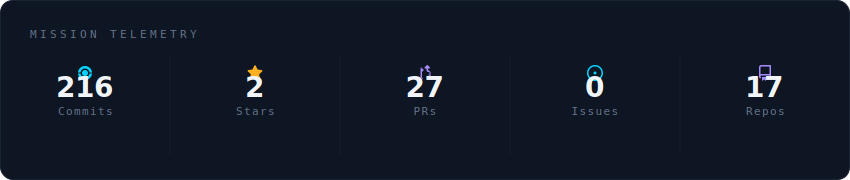

<!-- Galaxy Profile README Template
     Customize this file with your own info, then rename it to README.md
     in your GitHub profile repo (github.com/YOUR_USERNAME/YOUR_USERNAME).
     The SVG paths below point to assets/generated/ which are auto-generated
     by the GitHub Actions workflow or by running: python -m generator.main -->

  

 

  

 

  

 

  

 

<strong>More about me</strong>

 

Olá! Sou Luiz Felipe, tenho 22 anos e sou desenvolvedor Full Stack apaixonado por criar soluções tecnológicas escaláveis e eficientes. Natural de São Paulo, atuo no desenvolvimento de aplicações modernas, desde interfaces interativas até APIs robustas e arquiteturas bem estruturadas. Minha expertise abrange o desenvolvimento Front-End com **React.js, Next.js e TypeScript**, e Back-End com **Node.js, NestJS, Python e FastAPI**. Tenho experiência sólida em bancos de dados relacionais e NoSQL, containerização com **Docker**, e integração de APIs externas. Busco constantemente aprimorar minhas habilidades e aplicar as melhores práticas de desenvolvimento, incluindo princípios de Clean Architecture, SOLID e padrões de design. Compartilho meu conhecimento através dos meus projetos no GitHub, onde você pode acompanhar minha evolução e contribuições para a comunidade.

## 🧠 Princípios

Clean Architecture • SOLID • Design Patterns • Microsserviços • Performance • Código Limpo

## 🛠️ Stack Tecnológica

### 🎨 Front-End

  

### ⚙️ Back-End

  

### 📱 Mobile

  

### 🗄️ Banco de Dados

  

### 🐳 DevOps & Ferramentas

  

# 💼 O Que Eu Entrego

✔ Aplicações web performáticas  
✔ APIs RESTful escaláveis  
✔ Microsserviços  
✔ Integrações externas  
✔ Containerização com Docker  
✔ Modelagem eficiente de banco de dados  
✔ Versionamento e colaboração profissional  

 

  
  

 

  <i>
  "Professionalism and craftsmanship come from values that drive our discipline."
  </i>
   
  — Robert C. Martin

