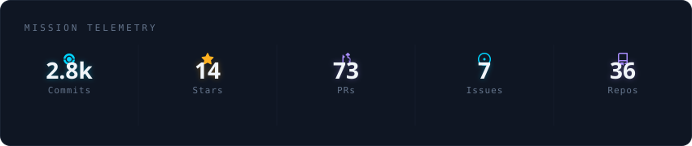

  

 

  

 

  

 

  

 

<strong>More about me</strong>

 

Olá! Sou Luiz Felipe, tenho 22 anos e sou desenvolvedor Full Stack apaixonado por criar soluções tecnológicas escaláveis e eficientes. Natural de São Paulo, atuo no desenvolvimento de aplicações modernas, desde interfaces interativas até APIs robustas e arquiteturas bem estruturadas. Minha expertise abrange o desenvolvimento Front-End com **React.js, Next.js e TypeScript**, e Back-End com **Node.js, NestJS, Python e FastAPI**. Tenho experiência sólida em bancos de dados relacionais e NoSQL, containerização com **Docker**, e integração de APIs externas. Busco constantemente aprimorar minhas habilidades e aplicar as melhores práticas de desenvolvimento, incluindo princípios de Clean Architecture, SOLID e padrões de design. Compartilho meu conhecimento através dos meus projetos no GitHub, onde você pode acompanhar minha evolução e contribuições para a comunidade.

## 🧠 Princípios

Clean Architecture • SOLID • Design Patterns • Microsserviços • Performance • Código Limpo

## 🛠️ Stack Tecnológica

### 🎨 Front-End

  

### ⚙️ Back-End

  

### 📱 Mobile

  

### 🗄️ Banco de Dados

  

### 🐳 DevOps & Ferramentas

  

# 💼 O Que Eu Entrego

✔ Aplicações web performáticas  
✔ APIs RESTful escaláveis  
✔ Microsserviços  
✔ Integrações externas  
✔ Containerização com Docker  
✔ Modelagem eficiente de banco de dados  
✔ Versionamento e colaboração profissional  

<strong>About me (English)</strong>

 

Hi! I'm Luiz Felipe, a 22-year-old Full Stack Developer passionate about building scalable, efficient technology solutions. Based in São Paulo, Brazil, I work across modern applications, from interactive interfaces to robust APIs and well-structured architectures. My expertise spans Front-End development with **React.js, Next.js, and TypeScript**, and Back-End with **Node.js, NestJS, Python, and FastAPI**. I have solid experience with relational and NoSQL databases, containerization with **Docker**, and integrating external APIs. I'm constantly working to sharpen my skills and apply development best practices, including Clean Architecture, SOLID, and design patterns. I share my work through my GitHub projects, where you can follow my progress and contributions to the community.

## 🧠 Principles

Clean Architecture • SOLID • Design Patterns • Microservices • Performance • Clean Code

## 🛠️ Tech Stack

### 🎨 Front-End

  

### ⚙️ Back-End

  

### 📱 Mobile

  

### 🗄️ Databases

  

### 🐳 DevOps & Tools

  

# 💼 What I Deliver

✔ High-performance web applications  
✔ Scalable RESTful APIs  
✔ Microservices  
✔ External integrations  
✔ Containerization with Docker  
✔ Efficient database modeling  
✔ Professional versioning and collaboration  

 

  
  

 

  SVGs gerados por <a href="https://github.com/vinimlo/galaxy-profile">vinimlo/galaxy-profile</a> 🌌

